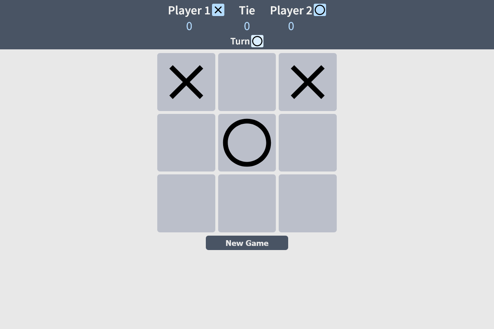
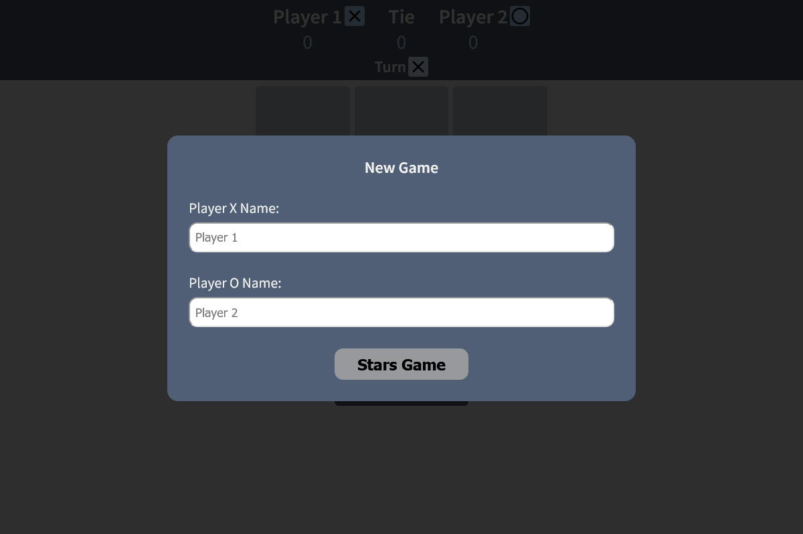

# Library

This is a solution to the [PROJECT: TIC TAC TOE](https://www.theodinproject.com/paths/full-stack-javascript/courses/javascript/lessons/tic-tac-toe)

## Description

make a Tic Tac Toe game you can play in your browser!. Practice project for JS Factory Functions and the Module Pattern.

### Screenshot

#### Desktop

##### Home

##### Form

### Links

- Solution URL: (https://github.com/AlexanderC04/tic-tac-toe.git)
- Live Site URL: (https://alexanderc04.github.io/tic-tac-toe/)

## Author

- Website - (https://github.com/AlexanderC04)
- Frontend Mentor - (https://www.frontendmentor.io/profile/AlexanderC04)
